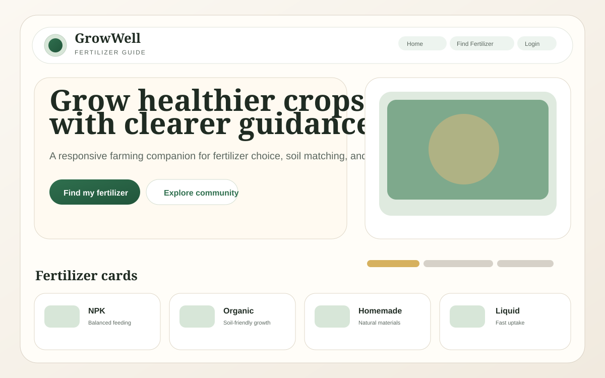
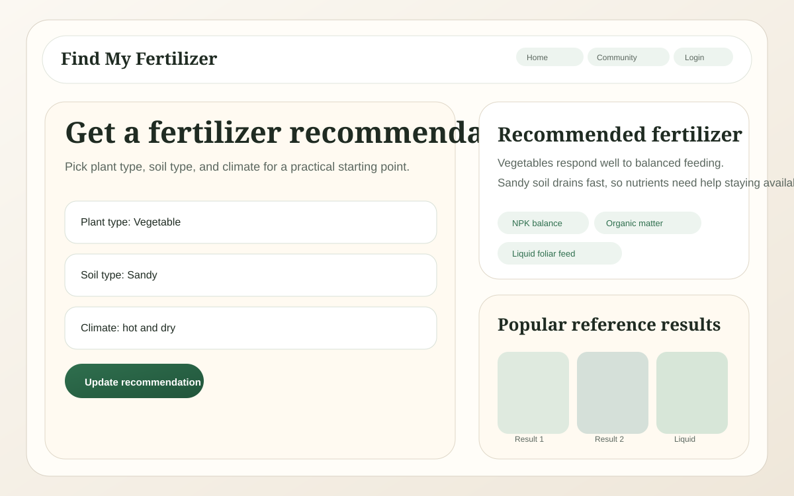
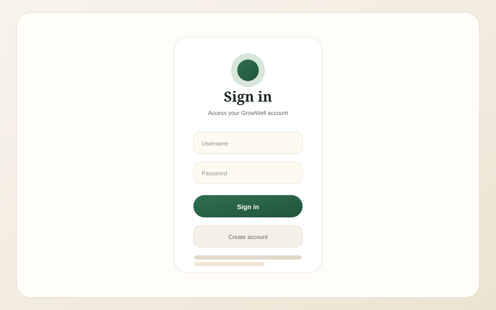

# GrowWell

GrowWell is a small farming and fertilizer guidance frontend project. It includes a refreshed landing page, a fertilizer recommendation page, a community page, and a simple login/register flow backed by a local Node.js server.

## Website Preview

These are lightweight visual previews of the current pages:

| Home | Fertilizer | Login |
| --- | --- | --- |
|  |  |  |

## Features

- Modern responsive UI with a shared design system
- Home page with fertilizer categories
- Fertilizer matcher with live recommendations
- Community page with farming content cards
- Login and registration forms connected to a local backend
- All images organized inside the `images/` folder

## Project Structure

- `home.html` - landing page
- `find-my-fertilizer.html` - fertilizer recommendation page
- `community.html` - community page
- `login.html` - login page
- `register.html` - account creation page
- `style.css` - shared styles
- `script.js` - shared frontend behavior
- `server.js` - local backend server
- `data/users.json` - local user store for the backend
- `images/` - all image assets

## Requirements

- Node.js 18 or newer

## Run Locally

1. Open a terminal in the project folder.
2. Start the server:

```bash
node server.js
```

3. Open this URL in your browser:

```text
http://localhost:3000
```

## Login Flow

1. Open `http://localhost:3000/register.html`
2. Create a new account
3. Go to `http://localhost:3000/login.html`
4. Sign in with the account you created

## Notes

- The backend stores users locally in `data/users.json`
- This is a lightweight demo backend, not production authentication
- If you add more images later, place them inside `images/` and update the paths in the HTML

## Customization Ideas

- Add a real database for authentication
- Replace the simple backend with Express if you want API growth
- Add a mobile menu for the navigation
- Expand the community page with posts and filters
